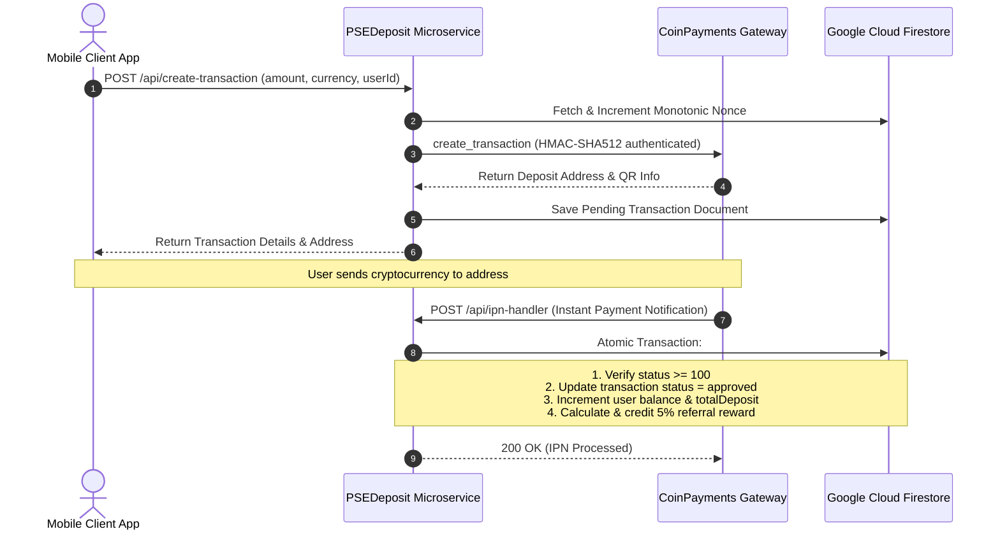

# PSEDeposit (Cryptocurrency Deposit & Referral Microservice)

[](https://nodejs.org)
[](https://expressjs.com)
[](https://firebase.google.com)
[](LICENSE)

PSEDeposit is a resilient Node.js / Express microservice that acts as an automated cryptocurrency deposit gateway and multi-tier referral reward processing engine for stock and trading platforms.

---

## Architecture & Transaction Workflow



---

## Key Features

- **Automated Deposit Generation**: Seamlessly bridges CoinPayments API with cryptocurrency deposit creation across 100+ digital currencies.
- **Monotonic Nonce Management**: Persistently coordinates transactional sequence numbers using Firestore atomic increments to eliminate race conditions.
- **Atomic Balance Updates**: Uses Firestore database transactions to ensure idempotency and prevent double-crediting on asynchronous webhooks.
- **Referral Reward Distribution Engine**: Automatically calculates and distributes multi-tier affiliate referral rewards (5% commission) directly to the sponsor's wallet.
- **12-Factor Cloud Configuration**: Decoupled from hardcoded credentials; fully configurable via environment variables or Cloud Secret Manager.

---

## API Endpoints

### 1. Health Check
- **`GET /health`**
- **Response:** `200 OK`
  ```json
  { "status": "ok" }
  ```

### 2. Create Deposit Transaction
- **`POST /api/create-transaction`**
- **Body:**
  ```json
  {
    "amount": 50.00,
    "currency1": "USD",
    "currency2": "USDT.TRC20",
    "buyer_email": "investor@example.com",
    "custom": "USER_FIREBASE_UID"
  }
  ```
- **Response:** `200 OK` (CoinPayments transaction metadata, deposit address, timeout, and QR URL).

### 3. Query Transaction Status
- **`GET /api/transaction/:txid`**
- **Response:** Real-time on-chain confirmation status and balance progress from CoinPayments.

### 4. CoinPayments IPN Webhook
- **`POST /api/ipn-handler`**
- **Description:** Receives webhook notifications from CoinPayments, validates confirmation status, updates user accounts, and triggers referral rewards atomically.

---

## Setup & Local Development

### Prerequisites
- Node.js 20+ runtime
- Google Cloud Firebase Project with Firestore enabled
- CoinPayments Merchant Account

### Step-by-Step Installation

1. **Clone the Repository:**
   ```bash
   git clone https://github.com/shayann07/PSEDeposit-main.git
   cd PSEDeposit-main
   ```

2. **Install Dependencies:**
   ```bash
   npm install
   ```

3. **Configure Environment Variables:**
   Copy the example `.env` file:
   ```bash
   cp .env.example .env
   ```
   Fill in your CoinPayments API credentials and Firebase Service Account JSON.

4. **Start the Server:**
   ```bash
   npm start
   ```

---

## License

Distributed under the MIT License. See [LICENSE](LICENSE) for more information.

Copyright (c) 2026 **shayann07**
