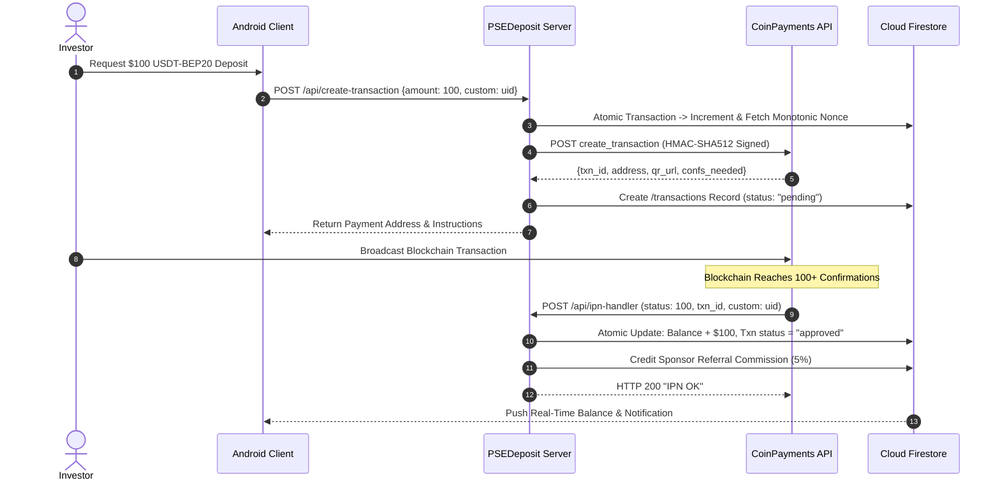

# PSE Deposit Service (Crypto Payment Gateway Microservice)

[](https://nodejs.org)
[](https://expressjs.com)
[](https://www.coinpayments.net)
[](https://firebase.google.com/docs/firestore)
[](https://render.com)
[](LICENSE)

> Production Node.js & Express crypto payment gateway bridging CoinPayments and Firebase Firestore, providing HMAC-SHA512 authenticated invoice creation, atomic monotonic nonce management, and real-time IPN webhook settlement.

---

## 📖 Overview

**PSEDeposit** is a dedicated payment gateway microservice engineered for the Philippine Stock Exchange fintech platform. Deployed as a high-availability container service (on **Render** / **Cloud Run**), this backend enables clients to create cryptocurrency deposit invoices (USDT-BEP20, USDT-TRC20, BTC, ETH), validates cryptographic HMAC signatures, and receives CoinPayments **Instant Payment Notifications (IPN)** to settle account balances atomically.

### Core Highlights
- **Cryptographic Request Signing**: Every CoinPayments API interaction is signed with HMAC-SHA512 using private API secrets.
- **Atomic Nonce Sequencing**: Manages strictly monotonically increasing transactional nonces via Cloud Firestore transactions to prevent timestamp collisions under concurrent loads.
- **Asynchronous Webhook Settlement**: Processes IPN callback webhooks with status verification (`status >= 100` blockchain confirmations) and updates investor balances idempotently.
- **Multi-Tier Affiliate Referral Kickbacks**: Automatically credits direct upline sponsors with their referral commission percentage upon verified deposit confirmation.
- **Enterprise 12-Factor Security**: Completely zero-hardcoded secrets, managed entirely through environment variables and service account key injection.

---

## 🏗️ Architecture & Webhook Flow

```mermaid
graph TD
    subgraph Client Application
        App[PSE Android User App]
    end

    subgraph PSEDeposit Microservice (Render)
        Router[Express.js REST Endpoints]
        HMAC[HMAC-SHA512 Auth Engine]
        Nonce[Firestore Nonce Generator]
        IPN[IPN Webhook Controller]
    end

    subgraph External Payment Rails
        CP[CoinPayments API Gateway]
        BC[(Blockchain Network: BSC / TRON)]
    end

    subgraph Firebase Cloud Infrastructure
        Firestore[(Cloud Firestore NoSQL)]
        FCM[Firebase Cloud Messaging v1]
    end

    App -->|POST /api/create-transaction| Router
    Router --> Nonce
    Nonce <-->|Atomic Txn| Firestore
    Router --> HMAC
    HMAC -->|Signed API Request| CP
    CP -->|Return Address & QR| Router
    Router -->|Pending Doc| Firestore
    Router -->> App

    App -.->|Transfer Crypto| BC
    BC -->|Confirm TX| CP
    CP -->|POST /api/ipn-handler| IPN
    IPN -->|Verify Status >= 100| IPN
    IPN -->|Atomic Credit Balance| Firestore
    IPN -->|Send Push Receipt| FCM
```

### Complete Deposit Settlement Lifecycle



---

## ✨ REST API Reference

### 1. `POST /api/create-transaction`
Creates a new cryptocurrency deposit order on CoinPayments and registers the transaction in Firestore.

**Request Payload**:
```json
{
  "amount": 100.0,
  "currency1": "USD",
  "currency2": "USDT.BEP20",
  "buyer_email": "investor@example.com",
  "custom": "USER_FIREBASE_UID"
}
```

**Response Payload**:
```json
{
  "error": "ok",
  "result": {
    "amount": "100.00000000",
    "txn_id": "CPFA4XYZ...",
    "address": "0x71C...49A",
    "confirms_needed": "10",
    "timeout": 2700,
    "status_url": "https://www.coinpayments.net/..."
  }
}
```

### 2. `GET /api/transaction/:txid`
Queries current blockchain confirmation status directly from the CoinPayments ledger.

### 3. `POST /api/ipn-handler`
Asynchronous webhook endpoint receiving CoinPayments Instant Payment Notifications. Verifies IPN integrity and triggers atomic account balance updates upon complete blockchain confirmation (`status >= 100`).

### 4. `GET /health`
Liveness and readiness probe returning `{ "status": "ok" }`.

---

## 🛠️ Technology Stack Matrix

| Component | Technology | Description |
|---|---|---|
| **Runtime** | Node.js 20.x | Modern server-side JavaScript runtime |
| **Web Framework** | Express.js 4.x | Fast, unopinionated HTTP routing framework |
| **Payment Gateway** | CoinPayments REST API | Multi-cryptocurrency processing engine |
| **Cryptography** | Node.js native `crypto` | HMAC-SHA512 signature hashing |
| **Cloud Database** | Google Cloud Firestore | Distributed ACID NoSQL document storage |
| **SDK** | `firebase-admin` | Administrative Firebase SDK for Firestore updates |
| **Deployment** | Render / Docker | Cloud PaaS container hosting |

---

## 🚀 Getting Started

### Prerequisites
- **Node.js 20 LTS** or higher.
- A verified **CoinPayments Merchant Account** (with API Public/Private keys and IPN secret).
- A **Firebase Service Account JSON** with Firestore read/write permissions.

### Environment Configuration

1. **Clone the Repository**:
   ```bash
   git clone https://github.com/shayann07/PSEDeposit-main.git
   cd PSEDeposit-main
   ```

2. **Configure Environment Variables**:
   ```bash
   cp .env.example .env
   ```
   Edit `.env`:
   ```env
   PORT=3000
   NODE_ENV=development
   PUBLIC_KEY=your_coinpayments_public_key
   PRIVATE_KEY=your_coinpayments_private_key
   IPN_SECRET=your_coinpayments_ipn_secret
   FIREBASE_SERVICE_ACCOUNT_JSON={"type":"service_account",...}
   ```

3. **Install Dependencies & Start**:
   ```bash
   npm install
   
   # Run in development mode
   npm run dev

   # Run in production mode
   npm start
   ```

---

## 📄 License

This project is open-source software licensed under the [MIT License](LICENSE) — Copyright (c) 2026 [shayann07](https://github.com/shayann07).
